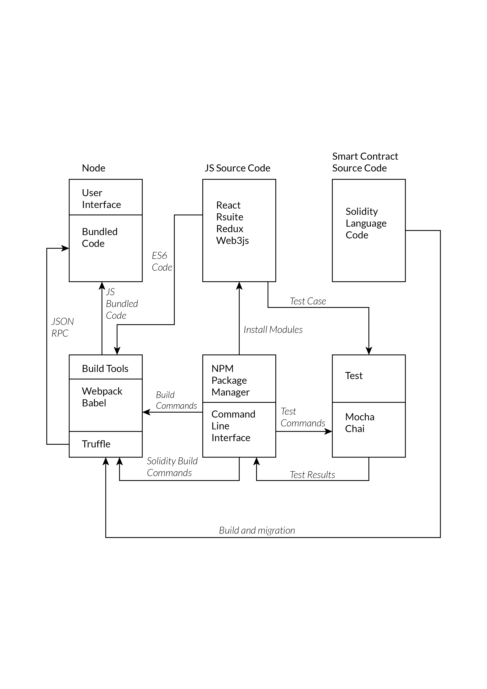

#Sikka- A Decentralized Payment System

##Table of Contents
- [ Introduction ](#introduction)
- [Methodoloy](#methodoloy)
    - [System Architecture](#system-architecture)
        - [System Components](#system-components)
            - [User](#user)
            - [P2P nodes](#p2p-nodes)
            - [BlockChain](#blockchain)
            - [Mining](#mining)
        - [Activity Diagram](#activity-diagram)
    - [Tools Used](#tools-used)
    - [Libraries](#libraries)
- [Limitations and Further Enhancements](#limitations-and-further-enhancements)
- [LICENCE](#licence)

##Introduction
Sikka is implemented on Ethereum as a Smart Contract and includes an ERC20 compatible utility token, called SIK, which is used for payments.

SIK is a general-purpose cryptocurrency that is:
- Fixed supply
- Fractionally divisible
- Non-inflationary
- Fungible and transferable 

##Methodoloy

###System Architecture

####System Components
#####User
There are two types of users: senders and receivers. The users use wallet app to perform various transactions such as sending currency.  
#####P2P nodes
P2P network is the type of network that doesn’t have any central system. Peer-to-peer (P2P) computing or networking is a distributed application architecture that partitions tasks or workloads between peers. 
#####BlockChain
BlockChain is an open, distributed ledger that can record transactions between two parties efficiently and in a verifiable and permanent way. It forms the heart of Sikka.
#####Mining
Mining is the process of adding transactions to the large distributed public ledger of existing transactions. The main incentive for mining is that users who choose to use a computer for mining are rewarded for doing so.

###Activity Diagram

###Tools Used
- NPM
- Truffle
- Remix IDE
- Ethereum Mist Browser
- Metamask
- Geth

###Libraries
- Web3.JS
- React.JS
- Webpack
- Mocha
- Chai

|  | 
|---|---|
| System Integration |

##Limitations and Further Enhancements
Limitations in our system observed so far:
- Since the value of cryptocurrency is very high, this system might not be favorable for daily micro transactions.
- Remembering of user tokens is a near tough thing to do.
- The resource demand for system running is high.
- Risk of ‘51% attack’.
- Political disagreement.

This system can be enhanced to include these following features:
- The system can be integrated to different e-commerce platforms.
- API could be provided to different trading platforms for their use.
- Different contactless technologies like MasterCard can be integrated with the system for e-shopping and contactless trading application.	
- Banks can adopt cryptocurrency to make their system more secure and reliable.

## LICENCE

Released under the [MIT](./LICENSE) License. 
